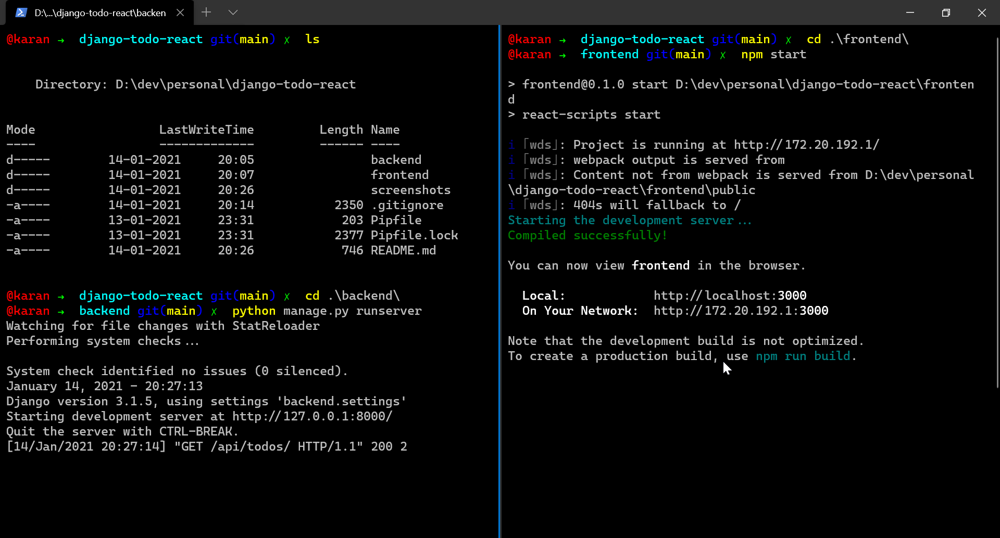
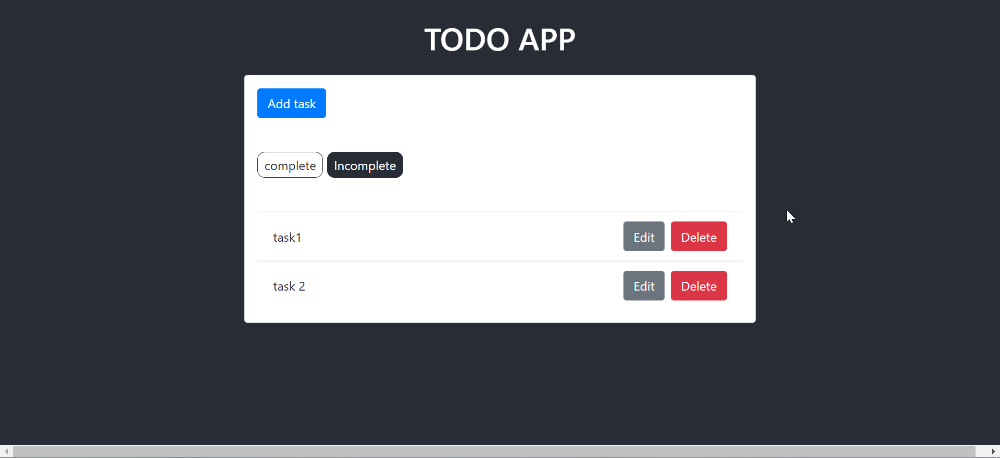
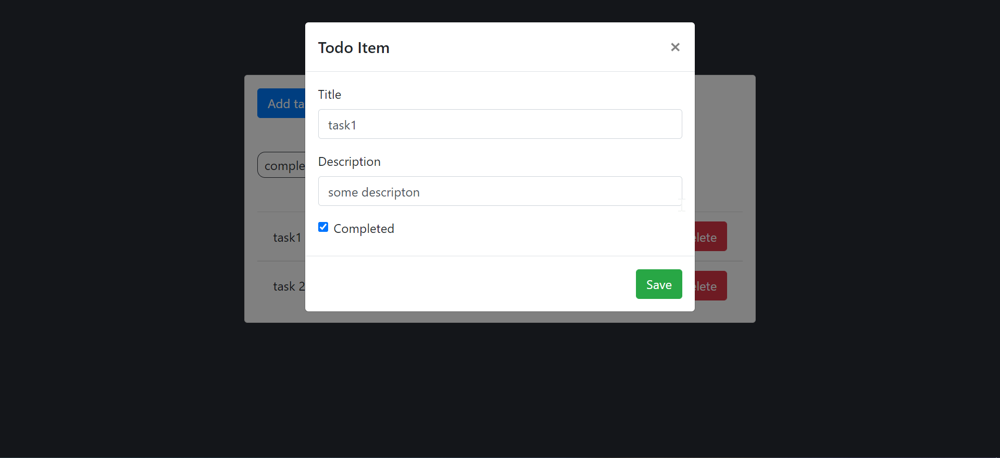
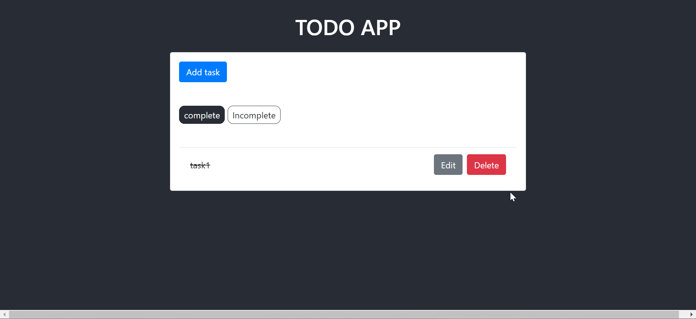

# Django ToDo React

The application combines two technologies django and react in one folder. The backend folder contains django backend and frontend folder contains the react frontend.
I am using django rest framework and axios to recieve and send request.

# Install and Run

After cloning the repository, inside the folder.

```
pip install pipenv
pipenv shell
pipenv install
```

once the dependencies are created. you can move inside the `backend/` directory and execute this command.

```
python manage.py runserver
```

Open another terminal window while that one's still running and move inside the `frontend/` directory.
Execute these commands then

```
npm install
npm start
```

# Screenshots

### Terminal Preview



### Home Screen



### Edit a Task



### Completed Task Lists



# Author

Karan Mittal
